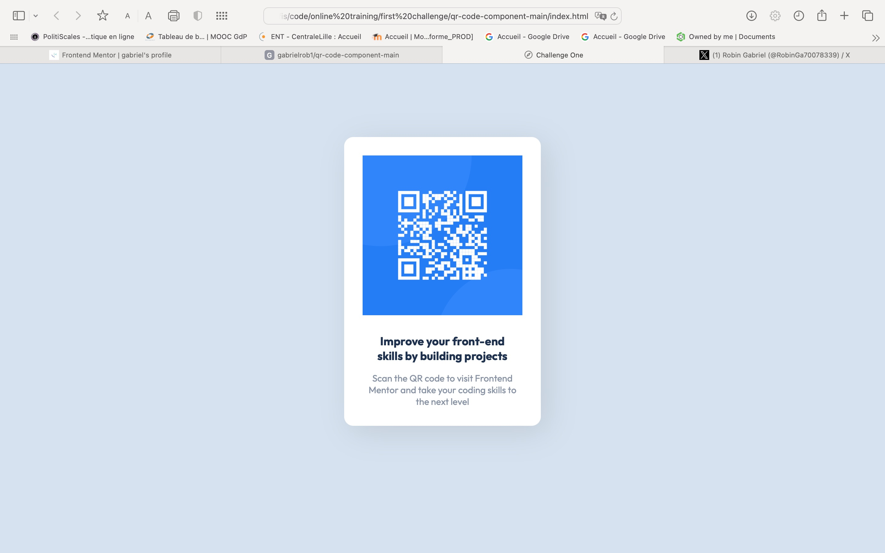

# Frontend Mentor - QR code component solution

This is a solution to the [QR code component challenge on Frontend Mentor](https://www.frontendmentor.io/challenges/qr-code-component-iux_sIO_H). Frontend Mentor challenges help you improve your coding skills by building realistic projects. 

## Table of contents

  - [Screenshot](#screenshot)
  - [Links](#links)
- [My process](#my-process)
  - [Feedbacks](#Feedbacks)
- [Author](#author)

### Screenshot

### Links

- Solution URL: [https://github.com/my_solution](https://github.com/gabrielrob1/qr-code-component-main.git)

## My process

After following my first HTML/CSS course on [OpenClassrooms](https://openclassrooms.com), I'm now trying to master deeper some skills. After coding the HTML part, the real "challenge" for me was to adjust correctly the page with the following CSS properties  padding, margin, justify-content, align-items...  

### Feedbacks

I really want to progress in CSS in particular, so don't be shy to give feedbacks, whatever the subject !

## Author

- Frontend Mentor - [@gabrielrob1](https://www.frontendmentor.io/profile/gabrielrob1)
- Twitter - [@RobinGa70078339](https://www.twitter.com/RobinGa70078339)
